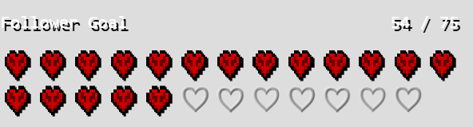
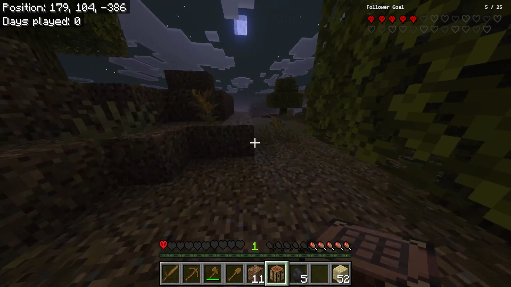

# Minecraft Hardcore Heart Follower Goal Widget

A custom Streamlabs Goal Widget that replaces the default progress bar with a Minecraft-inspired Hardcore heart display.

[](preview.png)

## Features

* Minecraft Hardcore-style follower goal
* Custom pixel-art heart asset
* 25 total hearts
* Automatically wraps after 13 hearts
* Filled hearts use a custom PNG
* Empty hearts use lightweight outline hearts (`♡`)
* Uses the **Press Start 2P** font
* Automatically updates from Streamlabs Goal Widget events
* Fully self-contained HTML, CSS, and JavaScript
* Designed for Streamlabs Desktop and Streamlabs Web

---

## Preview

| State         | Description                                   |
| ------------- | --------------------------------------------- |
| Filled Hearts | Represent completed follower progress         |
| Empty Hearts  | Represent remaining followers needed          |
| Header        | Displays `Follower Goal` and current progress |

---

## Requirements

* Streamlabs account
* Streamlabs Goal Widget
* Streamlabs Desktop or Streamlabs Web
* Press Start 2P font enabled in Streamlabs

---

## Repository Structure

```text
follower-goal-hearts/
├── README.md
├── html.html
├── css.css
├── js.js
├── assets/
│   └── hc-heart.png
└── preview.png
```

---

## Installation

### 1. Create a Goal Widget

In Streamlabs:

1. Open the Streamlabs Dashboard.
2. Navigate to **All Widgets → Goal Widgets → Follower Goal**.
3. Create or edit your follower goal.
4. Select **Custom Widget**.

---

### 2. Upload the Heart Asset

Open the **Assets** tab inside the widget editor.

Upload:

```text
assets/hc-heart.png
```

Keep the filename exactly as:

```text
hc-heart.png
```

The widget expects this filename by default.

---

### 3. Copy the Widget Code

Replace the contents of each tab with the corresponding file:

| Streamlabs Tab | Repository File |
| -------------- | --------------- |
| HTML           | `html.html`     |
| CSS            | `css.css`       |
| JavaScript     | `js.js`         |

Save the widget.

---

### 4. Add the Widget to Streamlabs Desktop

Add the widget as a Browser Source.

Recommended dimensions:

```text
Width: 362
Height: 90
```

If changes do not appear immediately:

* Right-click the source
* Select **Refresh Cache**

---

## Configuration

The top of `js.js` contains the widget configuration.

```javascript
const CONFIG = {
  totalHearts: 25,
  title: 'Follower Goal',
  heartImage: 'hc-heart.png'
};
```

### Available Options

| Setting       | Description             | Default         |
| ------------- | ----------------------- | --------------- |
| `totalHearts` | Total hearts displayed  | `25`            |
| `title`       | Widget header text      | `Follower Goal` |
| `heartImage`  | Uploaded asset filename | `hc-heart.png`  |

---
Demo

See the widget in action during live streams:

🎮 Twitch: https://www.twitch.tv/AndyTheMakerMC

Live Stream Schedule
Monday — 7:00 PM Eastern
Wednesday — 7:00 PM Eastern
Friday — 7:00 PM Eastern
Saturday — 7:00 PM Eastern
---

## How It Works

Streamlabs provides follower goal information through two events:

```javascript
goalLoad
goalEvent
```

When either event fires, the widget receives:

```javascript
detail.amount.current
detail.amount.target
```

The widget calculates progress:

```javascript
const percent = current / target;
```

The percentage is converted into hearts:

```javascript
const filledHearts = Math.floor(percent * totalHearts);
```

Each heart slot is generated dynamically:

* Filled hearts use the custom PNG.
* Empty hearts use the `♡` character.

The widget redraws itself automatically whenever the goal updates.

---


## Customization

### Change the Number of Hearts

```javascript
totalHearts: 25
```

### Change the Widget Title

```javascript
title: 'Follower Goal'
```

### Use a Different Heart Image

Upload a new image to Streamlabs Assets and update:

```javascript
heartImage: 'my-heart.png'
```

---

## Troubleshooting

### Hearts Do Not Appear

Verify:

* `hc-heart.png` is uploaded to the widget Assets tab.
* The filename exactly matches:

```text
hc-heart.png
```

* The widget has been saved.

---

### Widget Is Too Wide

Verify the Browser Source dimensions:

```text
Width: 362
Height: 90
```

---

### Changes Do Not Update

Refresh the browser source cache:

1. Right-click the source.
2. Select **Refresh Cache**.

---

### Font Does Not Match

Ensure **Press Start 2P** is available in Streamlabs Desktop.

If unavailable, replace:

```css
font-family: 'Press Start 2P', monospace;
```

with a different font.

---

## License

This project is licensed under the MIT License.

See `LICENSE` for details.

---

## Developed by Charles J Gantt for Andy The Maker

This widget was originally developed for the **Andy The Maker** Twitch channel and is part of the broader Andy The Maker streaming ecosystem.

Andy The Maker creates Minecraft content focused on:

* Minecraft Hardcore Survival
* The Forgelands long-term survival world
* The Ancient Lands archaeology series
* Live streams and community-driven adventures
* World-building, lore, and large-scale infrastructure projects

If you enjoy this widget, consider following the channel and supporting future development.

### Follow Andy The Maker

* 🌐 Website: https://www.andythemakermc.xyz
* 🎮 Twitch: https://www.twitch.tv/AndyTheMakerMC
* ▶️ YouTube: https://www.youtube.com/@AndyTheMakerMC
* 📸 Instagram: https://www.instagram.com/AndyTheMakerMC
* 🎵 TikTok: https://www.tiktok.com/@AndyTheMakerMC
* 🐦 X (Twitter): https://x.com/AndyTheMakerMC
* 👥 Facebook: https://www.facebook.com/AndyTheMakerMC

Search for **@AndyTheMakerMC** across your favorite platforms to stay connected.

### Support the Channel

If you'd like to support future widgets, overlays, and Minecraft content, consider joining the community on Patreon or leaving a tip through Ko-fi.

* ❤️ Patreon: https://www.patreon.com/AndyTheMakerMC
* ☕ Ko-fi: https://ko-fi.com/AndyTheMakerMC

Your support helps fund:

* Stream assets and widget development
* Minecraft worlds and server infrastructure
* Community events and challenges
* New videos, live streams, and tutorials

Thank you for being part of the Andy The Maker community.

